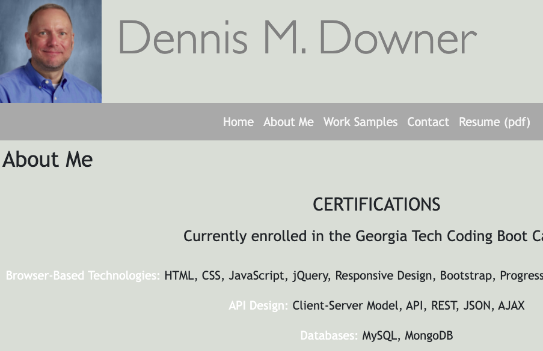

# Downer-Portfolio

## Your Task

The task was to develop a portfolio of work to showcase skills and talents to employers looking to fill a part-time or full-time position. It should meet all critical requirements necessary to satisfy a typical hiring manager’s needs.  It should highlight my strongest work as well as the thought processes behind it.

The following acceptance criteria was as follows:

## Acceptance Criteria

```
GIVEN I need to sample a potential employee's previous work
WHEN I load their portfolio
THEN I am presented with the developer's name, a recent photo or avatar, and links to sections about them, their work, and how to contact them
WHEN I click one of the links in the navigation
THEN the UI scrolls to the corresponding section
WHEN I click on the link to the section about their work
THEN the UI scrolls to a section with titled images of the developer's applications
WHEN I click on the images of the applications
THEN I am taken to that deployed application
WHEN I resize the page or view the site on various screens and devices
THEN I am presented with a responsive layout that adapts to my viewport
```
## Page Structure & Attributes

It has a classic, elegant color scheme so that the pictures and icons on the page draw all of the attention.

The page consists of 4 primary sections:
  * A header with a photo and navbar
  * A footer with contact links
  * A section which serves as a mini-resume
  * A section which highlights my work so far
  
Semantic html was used throughout allowing for better accessibility.  All images have ALT tags.

The page is designed for easy navigation.

A link was created where a person can click to get a pdf copy of my resume.

The navigation bar and cards used Bootstrap to allow for responsive design on smaller devices.

## URL

https://downerdm.github.io/Downer-Portfolio/

## Screenshot


